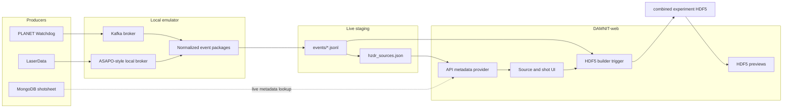
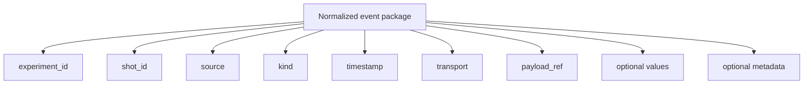
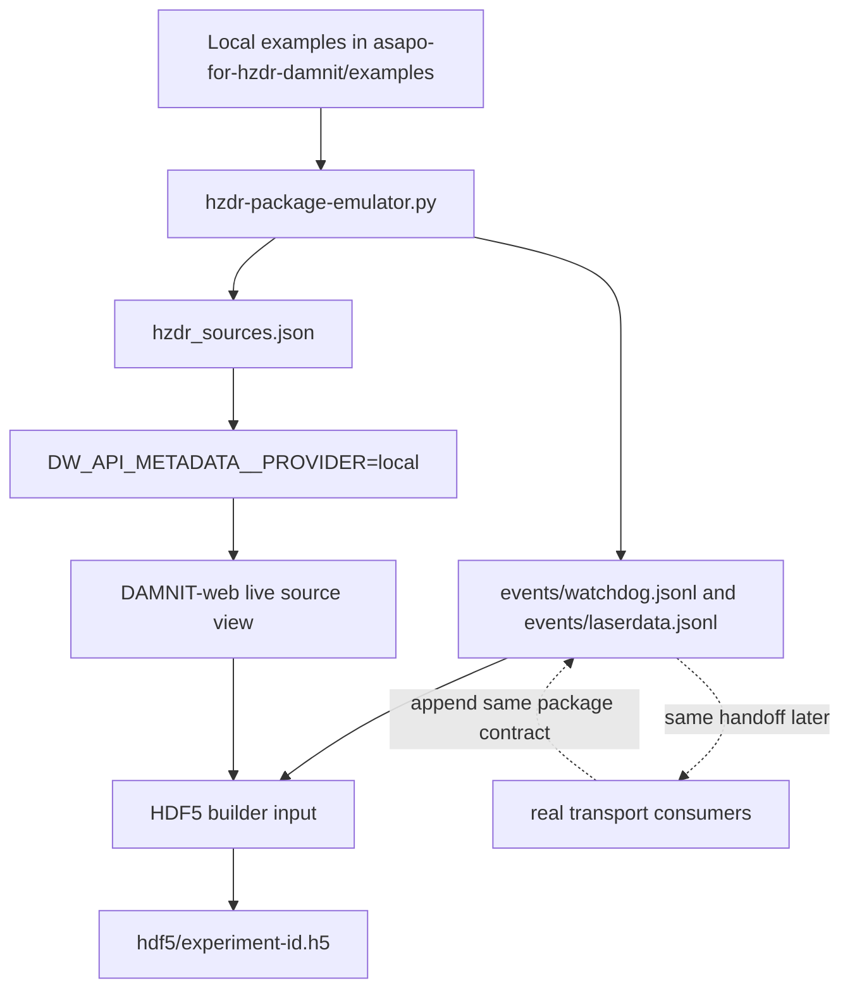
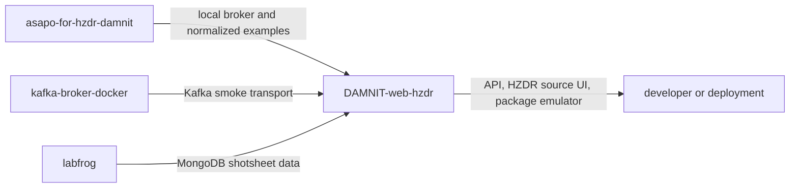

# DAMNIT Web

Monorepo containing projects required to serve DAMNIT data over the web.

## HZDR Data Flow

The HZDR integration keeps DAMNIT-web as a reader. Producers send normalized
data packages through local emulator transports first, then the same package
contract can move to real ASAPO or Kafka services.



The important package join key is:

```text
experiment_id + shot_id
```

Each normalized package has the same core shape whether it came from the local
emulator or a real transport:



## Emulator To Real

The local emulator is deliberately shaped like the production path:



Run the emulator:

```powershell
powershell -NoProfile -ExecutionPolicy Bypass -File .\scripts\hzdr-launch.ps1 -InitConfig
powershell -NoProfile -ExecutionPolicy Bypass -File .\scripts\hzdr-launch.ps1
```

Edit `scripts/hzdr-launch.config.json` between those commands if your sibling
repositories are not under `C:/GitLab`.

It writes:

```text
.generated/hzdr-package-emulator/events/*.jsonl
.generated/hzdr-package-emulator/hdf5/experiment-id.h5
.generated/hzdr-package-emulator/hzdr_sources.json
```

Set `emulator.shotCount` and `emulator.shotIncrement` in
`scripts/hzdr-launch.config.json` to generate more shots. Inspect the generated
HDF5 with:

```powershell
cd api
uv run python scripts/inspect-hzdr-hdf5.py ..\.generated\hzdr-package-emulator\hdf5\exp-2026-05-draco.h5
```

## Repository Roles



## More Detail

- [FLOW.md](FLOW.md) explains the API config, HZDR source model, and frontend
  route behavior.
- [HZDR-INTEGRATION.md](HZDR-INTEGRATION.md) lists the local coordinator
  commands and sibling repositories.
