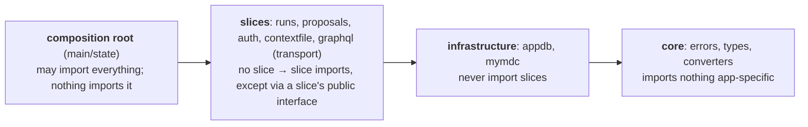

# Architecture

!!! warning

    This document summarises the **target** architectural pattern for the DAMNIT web API.

    Code may not have been refactored to match this pattern yet.

## The pattern, in one sentence

`damnit_api` is organised as vertical feature slices with port/adapter edges.

Vertical slices means that each capability owns a module containing everything from its HTTP/GraphQL surface down to its data access.

Port/adapter edges means that I/O boundaries (external databases, MyMdC, etc...) are abstracted behind repositories and ports.

For more information, see [ADR-000](adr/000-vertical-slice-architecture.md).

## Package map

| Package                           | Capability                              | What belongs there                                                                                                        | Status  | Today                                                                     |
| --------------------------------- | --------------------------------------- | ------------------------------------------------------------------------------------------------------------------------- | ------- | ------------------------------------------------------------------------- |
| `runs/`                           | Run/variable data - the core domain     | Domain models, repository interface + implementations, serialisation, preview extraction, its GraphQL types and resolvers | Planned | `db.py` + `data.py`; resolvers in `graphql/queries.py`/`subscriptions.py` |
| `proposals/`                      | Proposal metadata and lookup            | Proposal models, MyMdC-backed metadata services, path locator                                                             | Planned | `metadata/`                                                               |
| `auth/`                           | Authentication and authorisation        | OAuth flow, sessions, token store, `User`, permission classes, the membership policy                                      | Partial | Policy still in `metadata/services.py`                                    |
| `contextfile/`                    | Context-file viewing                    | File reading, watching, its routes                                                                                        | Done    | As-is                                                                     |
| `graphql/`                        | GraphQL transport only                  | Schema assembly, context, directives, controller binding - no resolvers, no domain logic                                  | Partial | Assembly still in `shared/gql.py`; resolvers still here                   |
| `appdb/`                          | The app's own database (infrastructure) | Models, engine/session plumbing for `dw_api.sqlite`                                                                       | Planned | `_db/`                                                                    |
| `mymdc/`                          | MyMdC client (infrastructure)           | Ports, clients, vendored models                                                                                           | Planned | `_mymdc/`                                                                 |
| `core/`                           | Cross-cutting, framework-free           | Shared error types, `DamnitType`, value types, converters                                                                 | Planned | `shared/` + `utils.py`                                                    |
| `main.py` / `app.py` / `state.py` | Composition root                        | `AppState`, `create_*` factories, `create_app()` - the only place that may import everything and read settings            | Partial | `main.py` only                                                            |

Where new code goes:

- Business logic: the slice that owns the capability.
- Framework-free code needed by several slices: `core/` (`shared/` for now).
- Code that talks to an external system: behind a port/repository in the infrastructure package.
- Wiring: the composition root.
- If none of these fit, check ADR-000 rather than extending `utils.py`.

For naming rules and the planned renames, see [ADR-000](adr/000-vertical-slice-architecture.md).

## Import direction

Rules, currently enforced by review (an import linter can enforce them mechanically, see the TODOs in ADR-000):

1. **Downward only.** Slices import `core` and infrastructure. Slices never import the composition root or another slice's internals. Importing another package's `_underscore` name is always wrong.
2. **The composition root is the top.** It may import everything; nothing imports it. If importing a slice from the composition root forces a function-body import, the type probably belongs in `core/`.
3. **Settings are read at the composition root only.** Everything else receives configuration as parameters.
4. **Authorisation is applied at the edge.** Routes and resolvers use dependencies and permission classes. Services stay auth-agnostic.
5. **No `if settings.is_local:` outside the composition root.** Local mode is selected by composition, not conditionals.

The current code violates some of these rules:

- `auth` <--> `metadata` import cycle
- `shared/gql.py`'s import-everything role
- Function-body imports working around circular imports
