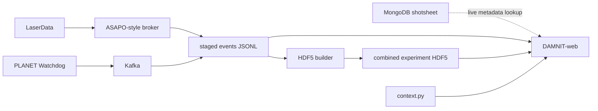
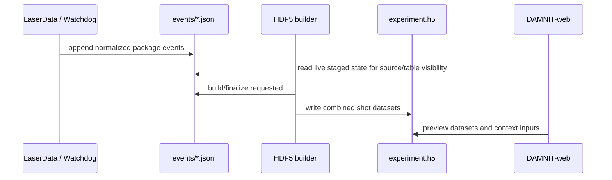

# HZDR Integration

DAMNIT-web HZDR mode is source-first rather than proposal-first. The working
unit is a source with shot metadata, staged event packages, context columns,
trend previews, and combined HDF5 output.

This page is layered on purpose: start with the quick path, then expand the
sections that match what you are trying to debug.

## Quick Path

1. Create the launcher config.

```powershell
powershell -NoProfile -ExecutionPolicy Bypass -File ..\scripts\hzdr-launch.ps1 -InitConfig
```

2. Edit the generated config.

```text
scripts/hzdr-launch.config.json
```

3. Start the emulator, API, and frontend.

```powershell
powershell -NoProfile -ExecutionPolicy Bypass -File ..\scripts\hzdr-launch.ps1
```

4. Open the workspace.

```text
http://127.0.0.1:5173/home
```

5. Use the flow monitor to send test traffic.

```text
http://127.0.0.1:5173/flow-monitor
```

## Mental Model



LaserData creates new shots. Watchdog/Kafka enriches existing shots. Producers
append JSONL continuously. HDF5 is created later by an explicit build/finalize
step that reads those staged JSONL packages. MongoDB remains the live metadata
and context-join source.

## JSONL to HDF5

The JSONL-to-HDF5 transition is a boundary, not an automatic side effect of
polling DAMNIT.



In the local emulator, the **Build HDF5** button in the flow monitor represents
that build/finalize request. In production, the same boundary should be triggered
by the operational package-builder process: for example a run-close hook,
end-of-shot-set signal, scheduled builder job, or message consumed by a builder
service. The important contract is that the builder consumes the staged package
stream and writes the combined HDF5 path that DAMNIT can later read.

<details>
<summary>Launcher config</summary>

The launcher reads:

```text
scripts/hzdr-launch.config.json
```

Use the example file as the shared shape for local and real-adjacent testing:

```text
scripts/hzdr-launch.config.example.json
```

Important sections:

- `paths`: repo folders and generated output locations.
- `emulator`: source key, starting shot number, shot count, and increment.
- `connections.kafka`: bootstrap server and topic.
- `connections.asapo`: local broker URL/spool settings.
- `connections.mongo`: MongoDB URI, database, and source collection.

The launcher generates:

```text
.generated/hzdr-package-emulator/events/*.jsonl
.generated/hzdr-package-emulator/hdf5/<experiment-id>.h5
.generated/hzdr-package-emulator/hzdr_sources.json
```

Useful launcher modes:

```powershell
powershell -NoProfile -ExecutionPolicy Bypass -File ..\scripts\hzdr-launch.ps1 -ValidateOnly
powershell -NoProfile -ExecutionPolicy Bypass -File ..\scripts\hzdr-launch.ps1 -NoBroker -NoApi -NoGui
```

</details>

<details>
<summary>Flow monitor</summary>

Open:

```text
http://127.0.0.1:5173/flow-monitor
```

The flow monitor is the visual test bench.

- **LaserData** appends a new emulated shot.
- **PLANET Watchdog** enriches the latest shot through the Kafka-style path.
- **Build HDF5** simulates the production build/finalize trigger and combines
  staged packages into the experiment HDF5.
- **Poll DAMNIT** reloads source metadata and table-visible shots.

Use it when you want to verify that shot numbers increment, package arrows move,
and DAMNIT can see the staged source data.

</details>

<details>
<summary>Source table</summary>

Open a source from `/home` or from the flow monitor.

The source table shows fixed shot metadata first, then active context columns.
Select any table cell to inspect it in the right panel.

- Numeric metadata cells show campaign trends automatically.
- Plot-backed context cells show an inline sparkline in the table.
- Plotly context previews render as charts in the selected-cell panel.
- The filter helper supports column selection, `includes`, equality, and
  greater-than/less-than numeric matching.
- The Day column is campaign-relative (`Day 1`, `Day 2`, ...), not the calendar
  date.

</details>

<details>
<summary>Context builder</summary>

Open a source, then choose **Context builder** from the table toolbar.

The builder writes editable context files under the configured API-side context
workspace:

```text
<context-root>/<source-key>/<user>/context.py
```

Column modes:

- Metadata: one selected metadata field.
- HDF5 summary: one HDF5 dataset summarized to a scalar.
- Image preview: one image-like dataset with a preview.
- Lineout preview: one line-like dataset with a preview.
- Plotly trend: one dataset rendered as a Plotly preview.
- Mongo query: one MongoDB-backed metadata lookup.
- Custom function: multi-input mode for combining values.

Imports are kept at the top of the file. Generated snippets are grouped by
column so the context file remains readable as it grows.

</details>

<details>
<summary>HDF5 output</summary>

The HDF5 builder consumes staged event packages from JSONL. It does not query
MongoDB to decide what to combine.

Local trigger:

```text
Flow monitor -> Build HDF5
```

Production trigger:

```text
run close / shot-set complete / scheduled builder / broker message
    -> HDF5 builder
    -> combined experiment HDF5
    -> DAMNIT reads hdf5_path and previews datasets
```

This repo does not prescribe which production trigger HZDR must use. It keeps
the contract explicit so the emulator can be replaced by a real builder service
without changing the DAMNIT table/context behavior.

Inspect the generated tree from Python:

```powershell
uv run python - <<'PY'
import h5py

path = r"..\.generated\hzdr-package-emulator\hdf5\hzdr-emulator.h5"
with h5py.File(path, "r") as handle:
    handle.visititems(lambda name, obj: print(name, getattr(obj, "shape", "")))
PY
```

In the app, open a source, select a shot, then expand **Shot detail** to view
HDF5 datasets and previews.

The emulator includes representative datasets under `fixtures/` so the context
builder can test the expected display types:

- `fixtures/scalars/laser_energy_j_by_shot`: scalar trend values.
- `fixtures/lineouts/pulse_energy_j_by_shot`: 1D lineout data by shot.
- `fixtures/images/camera_raw_by_shot`: floating-point image data.
- `fixtures/images/camera_mask_by_shot`: integer mask image data.
- `fixtures/images/camera_labels_by_shot`: integer label image data.
- `fixtures/stacks/camera_stack_by_shot`: small 3D image stacks.
- `fixtures/by_shot/<shot_id>/...`: per-shot scalar, lineout, image, and stack
  examples.

</details>

<details>
<summary>Kafka, ASAPO, and MongoDB verifier</summary>

The watchdog verifier can try Kafka first and fall back through ASAPO/local
broker and MongoDB:

```powershell
cd api
uv run python scripts/verify-hzdr-watchdog.py --config ..\scripts\hzdr-launch.config.json --mode auto
```

To require every configured backend:

```powershell
cd api
uv run python scripts/verify-hzdr-watchdog.py --config ..\scripts\hzdr-launch.config.json --mode all
```

Docker Kafka is fine. The important part is that
`connections.kafka.bootstrap` points at the broker the API and verifier can
reach, for example `127.0.0.1:9092`.

</details>

<details>
<summary>Troubleshooting</summary>

- If the frontend says `pnpm` is missing inside a script, run through
  `corepack pnpm` or install/enable pnpm for the Node version being used.
- If the app requires Node `>=24`, update Node before running the frontend.
- If context columns disappear, check the browser console and reload context
  results from the source table.
- If plot previews show JSON, the preview object should be shaped like
  `{ "kind": "plotly", "json": "..." }`.
- If HDF5 does not update, build from staged events and confirm the JSONL files
  contain the shots you expect.
- If MongoDB data appears stale, remember that MongoDB is live metadata; the
  HDF5 builder does not use it as the combine source.

</details>

## Related Files

- `README.md`: high-level project orientation.
- `FLOW.md`: provider model and HZDR-vs-EXFEL architecture notes.
- `HZDR-INTEGRATION.md`: launcher, repository list, and integration commands.
- `scripts/hzdr-launch.config.example.json`: shared connection/config shape.
- `api/scripts/verify-hzdr-watchdog.py`: Kafka/ASAPO/Mongo verifier.
