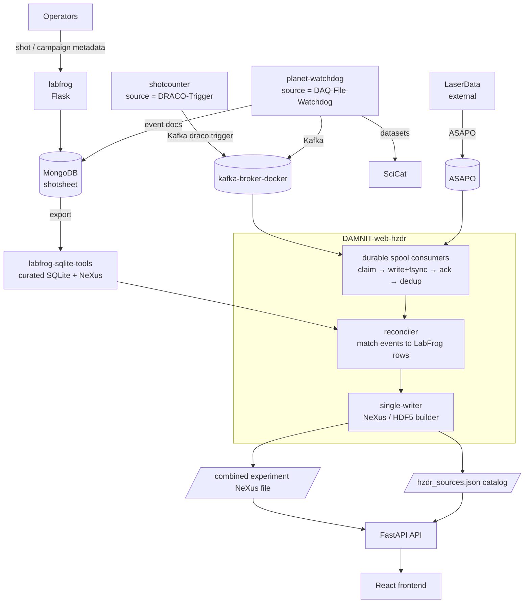

# System Overview: How the HZDR Repositories Work Together

This is the orientation map for the HZDR experimental data pipeline. It introduces
each repository, shows the end-to-end data flow, names the shared contracts that
hold the system together, and explains what the **end products** are and where
they land (here, in DAMNIT-web-hzdr).

For the precise data model and matching rules, see [architecture.md](architecture.md).
For per-item status and remaining work, see [integration-roadmap.md](integration-roadmap.md).
This document stays at the "what talks to what, and why" level.

## One-Sentence Summary

Instruments and trigger devices publish **immutable source events**; LabFrog owns
**campaign and shot context**; DAMNIT-web-hzdr **matches them once** and publishes
**one canonical per-campaign view** (a NeXus file plus a source catalog) that the
web UI reads.

## The Repositories

| Repository | Role | Stack | Position in the flow |
| --- | --- | --- | --- |
| **labfrog** | Operator captures structured shot/campaign metadata ("the shotsheet") | Flask + MongoDB | Source of truth for campaign + shot context |
| **labfrog-sqlite-tools-repo** | Exports LabFrog Mongo records to curated SQLite / NeXus / openPMD | Python CLI (`labfrog-sqlite`) | Turns LabFrog records into a portable, immutable export |
| **shotcounter** | TANGO device server; counts laser shots, emits canonical trigger events | PyTango + ZMQ + Kafka | Producer (`source = DRACO-Trigger`) |
| **planet-watchdog** | Watches instrument folders, parses files, writes events to Mongo/SciCat | Python GUI + `watchdog` | Producer (`source = DAQ-File-Watchdog`) |
| **kafka-broker-docker** | Single-node Kafka broker + helper scripts and examples | Docker Compose (KRaft) | Transport (local/dev message bus) |
| **asapo-for-hzdr-damnit** | Local harness proving the event contract + ASAPO/Kafka staging semantics | Node + Python | Transport test rig + contract reference |
| **DAMNIT-web-hzdr** | Reconciler/builder + FastAPI API + React frontend | Python + TS | Consumer; builds and serves the canonical outputs |

A third producer, **LaserData** (`source = LaserData`, transported over ASAPO),
exists in the wider HZDR setup but is not one of these repositories; it produces
events of the same shape described below.

## End-to-End Data Flow



> All producer paths carry the same `hzdr-event-v1` envelope (see the contracts
> below). `asapo-for-hzdr-damnit` is the local harness that proves this flow
> without a real broker; it stands in for the Kafka/ASAPO transport during
> development.

**The flow in words:**

1. **LabFrog** records the campaign and each shot's metadata into MongoDB. This is
   the operator-facing source of truth for *context*.
2. **labfrog-sqlite-tools** exports those Mongo records into an immutable curated
   SQLite + NeXus bundle, stamping the canonical `experiment_id` and preserving
   linking columns (`kafka_event_id`, transport offsets, `damnit_*` hints).
3. **Producers** publish immutable *source events* as they happen:
   - **shotcounter** emits a `draco.trigger` Kafka event per laser trigger.
   - **planet-watchdog** parses new instrument files, writes event docs to MongoDB
     and SciCat, and can publish to Kafka.
   - **LaserData** (external) publishes over ASAPO.
   - **kafka-broker-docker** is the broker those Kafka producers talk to locally.
   - **asapo-for-hzdr-damnit** is the local rig that proves this contract and the
     staging semantics before a real broker is wired in.
4. **DAMNIT-web-hzdr** consumes events through durable spool consumers
   (claim → write+fsync → ack → dedup), matches each event to the right LabFrog
   shot row, and runs a single-writer builder that produces the canonical outputs.
5. The **API and frontend** read those outputs. DAMNIT never asks producers to
   edit the canonical file or make their own matching decisions.

## The Contracts That Hold It Together

Three shared agreements are what let seven independently-developed repos cooperate.
Changing any of them is a cross-repo change.

### 1. The event envelope — `hzdr-event-v1`

Every transport event (Kafka, ASAPO, ZMQ) converges on one shape. The canonical
definition is the `HZDREventV1` Pydantic model at
`api/src/damnit_api/metadata/hzdr_event.py`. Because some producers do not share a
Python package with DAMNIT, the model is **vendored** into each producer/consumer,
and a committed JSON-Schema + sample fixture (`api/tests/fixtures/hzdr-event-v1.*`)
is copied byte-identically into each repo's `tests/fixtures/`. Each repo's
`test_hzdr_event.py` asserts its own copy matches — so a contract change shows up
as a failing test in every repo until the copies are re-synced. See
**Event Envelope** in [architecture.md](architecture.md) for the full field list.

Key fields: `schema_version`, `event_id` (stable, retry-safe), `experiment_id`,
`shot_id`/`shot_number`, `source`, `kind`, `timestamp` (UTC), `transport`,
`payload_ref` (source traceability), and optional `values`/`metadata`.

### 2. The identity / join key

Events and LabFrog rows are matched on **`experiment_id + shot_id`**. The canonical
shot key is:

```text
<experiment_id>:<local YYYYMMDD>:<shot_number padded to 6>
```

The date component matters because shot numbers may restart each day.
`shot_number` is authoritative only from TANGO/shotcounter; it is nullable
(`int | None`) by design while no end-to-end authoritative source is wired up.
DAMNIT's matcher resolves identity-first (exact Kafka event id → transport
position → same-day TANGO shot number → timestamp disambiguation → fallbacks); the
full ordering is in [architecture.md](architecture.md#matching).

### 3. The transports and their staging rule

Kafka and ASAPO are interchangeable transport options; ZMQ is an upstream
Draco/Watchdog detail. Whatever the transport, the consumer obeys one invariant:

> A message is acknowledged **if and only if** its event file has been written and
> fsync'd to the durable spool. Claim → write+flush → ack → dedup-by-`event_id`.

This is what `asapo-for-hzdr-damnit` exists to prove locally, and what
`DAMNIT-web-hzdr`'s `consumer/spool.py`, `consumer/asapo.py`, and
`consumer/kafka.py` implement for production.

## The End Products (What Lands Here)

The pipeline's output — the thing you are "sending here" — is a single canonical
view per campaign, built by DAMNIT and read by its API/frontend:

- **Combined experiment NeXus file** — preserves the LabFrog NeXus structure and
  adds DAMNIT's reconciliation result:

  ```text
  /entry/shots          canonical shot rows and match provenance
  /entry/source_events  normalized events, including unmatched ones
  /entry/data_products  files and internal dataset references
  /entry/laserdata      embedded small event arrays
  /entry/watchdog       Watchdog-derived values when present
  ```

- **`hzdr_sources.json`** — the source catalog that exposes the file through the
  HZDR API, written atomically (temp file + rename) on every build, with operator
  confirm/dismiss decisions persisted in a `hzdr_sources.review.jsonl` sidecar.
- **Curated SQLite / NeXus export** (from labfrog-sqlite-tools) — the immutable
  per-campaign LabFrog export that feeds the build and is retained for replay and
  audit. DAMNIT output is kept separate from this immutable input.

`runs.sqlite` is an optional future projection for legacy DAMNIT table workflows,
not a source of truth.

### Where the end products physically land

Everything is rooted at the DAMNIT data directory, `DW_API_DAMNIT_PATH` (the
production template uses `/data/damnit/hzdr`). The pieces arrive and are consumed
like this:

| Artifact | Produced by | Path / naming | Consumed by |
| --- | --- | --- | --- |
| Staged events | spool consumers in this API | `<DAMNIT_PATH>/spool/asapo/<campaign>/events.jsonl` and `<DAMNIT_PATH>/spool/kafka/<campaign>/<topic>.jsonl` | the builder (`--events-jsonl`, `--trigger-jsonl`, `--watchdog-jsonl`) |
| Immutable LabFrog export | labfrog-sqlite-tools | curated `*.sqlite` + `*.nxs` per campaign (kept separate from DAMNIT output) | the builder (`--labfrog-sqlite`, `--labfrog-nexus`) |
| Combined NeXus file | `hzdr-hdf5-builder.py` (`--output-nexus`/`--output-hdf5`, required) | a campaign `.nxs`/`.h5`; each catalog source records its `hdf5_path` | API shot detail / dataset preview |
| Source catalog | same builder (`write_sources_catalog`) | `hzdr_sources.json`, default written **next to the NeXus file** unless `--sources-file` overrides | API (`DW_API_METADATA__SOURCES_FILE`) |
| Operator review decisions | API confirm/dismiss endpoints | `hzdr_sources.review.jsonl` sidecar, merged on each rebuild (`VERIFIED > REVIEWED > BASE`) | the builder, on the next run |

The handoff into this app is one setting:
`DW_API_METADATA__PROVIDER=local` points the API at `hzdr_sources.json` on disk
(set `=mongo` to read the same catalog from a MongoDB collection instead). The
builder is **single-writer** per campaign (PID-stamped lock on the output file),
so it can safely run on a schedule while the API reads. Build it, then publish the
catalog atomically (temp file + rename) — the API and frontend pick up the new
end products on their next read with no restart.

A typical build invocation that ties the inputs to the outputs:

```bash
python api/scripts/hzdr-hdf5-builder.py \
  --experiment-id Solenoid_Beamline_Tests_01.2025 \
  --campaign-timezone Europe/Berlin \
  --labfrog-sqlite  <campaign>.sqlite \
  --trigger-jsonl   spool/kafka/<campaign>/hzdr.solenoid.triggers.jsonl \
  --events-jsonl    spool/asapo/<campaign>/events.jsonl \
  --output-nexus    <campaign>.nxs
# -> writes <campaign>.nxs and (next to it) hzdr_sources.json
```

## Running the Whole Thing Locally

Each repo has its own `CLAUDE.md` and `README.md` with exact commands. The fastest
ways in:

- **Everything at once (tests):** `scripts/test-all.ps1` in this repo runs all six
  sibling test suites in one command.
- **The contract + transport, no real broker:** `asapo-for-hzdr-damnit` →
  `launch-testing-suite.cmd` (local broker + GUI at `http://127.0.0.1:8765/`).
- **A real local Kafka broker:** `kafka-broker-docker` → `./deploy.sh`.
- **The shotsheet app:** `labfrog` → `uv run poe debug-with-dockerdb`.
- **A trigger producer:** `shotcounter` →
  `./scripts/start_local.sh --with-kafka --broker redpanda --test-mode`.
- **The file watcher (safe demo):** `planet-watchdog` → `uv run watchdog_test.py`.
- **This app (consumer + UI):** see [local-development.md](local-development.md).

## Where to Go Deeper

| You want… | Read |
| --- | --- |
| The exact data model, fields, and matching order | [architecture.md](architecture.md) |
| Per-repo status and the work remaining to go live | [integration-roadmap.md](integration-roadmap.md) |
| Verified test coverage and acceptance tests | [testing.md](testing.md) |
| Minimal build/test/launch for this app | [local-development.md](local-development.md) |
| A current-state snapshot for the next session | [handoff.md](handoff.md) |
| How any single repo is built and run | that repo's `CLAUDE.md` and `README.md` |
