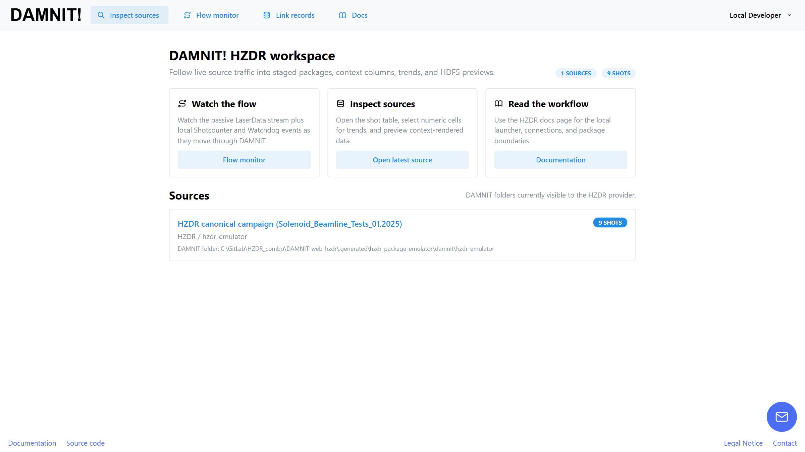
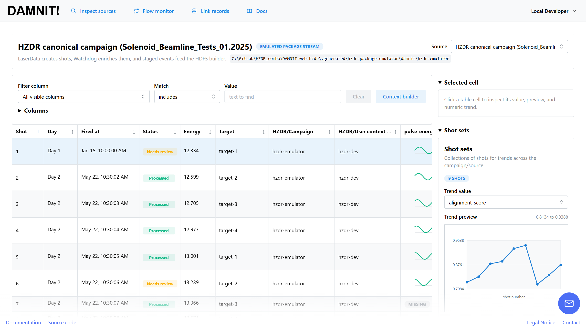
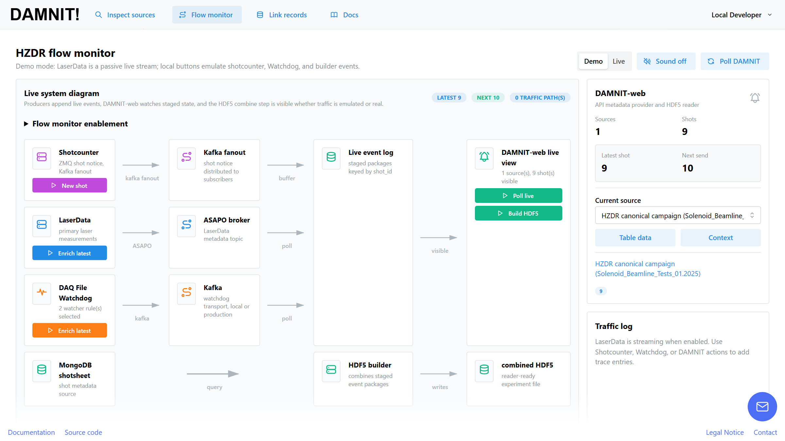
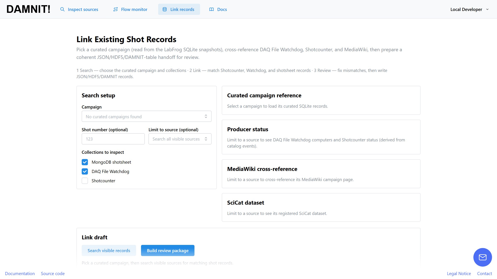
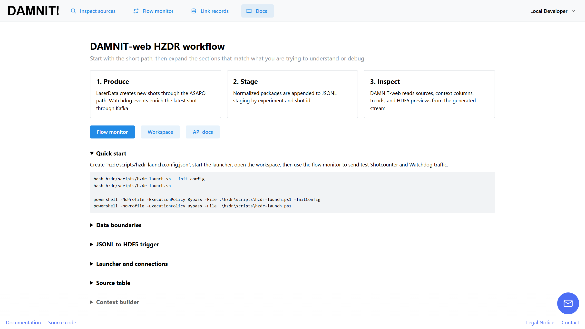

# Screenshots

Captured 2026-07-07 from a local stack (`hzdr/scripts/hzdr-launch.ps1` flow:
package-emulator data, `local` metadata provider, auth disabled) at
1600×900. To refresh after a UI change, launch the stack, seed a few shots
via `POST /metadata/hzdr/emulator/events`, and re-capture these five pages.

## Home — source workspace

The landing page (`/home`): entry points to the flow monitor, shot table,
and docs, plus the sources visible to the HZDR provider.

## Shot table

A source page (`/source/{source_key}`): the per-shot table with status
badges, campaign/context columns, inline trend sparklines, and the
selected-cell / shot-sets side panel.

## Flow monitor

`/flow-monitor`: the live system diagram from producers (Shotcounter,
LaserData, DAQ File Watchdog, MongoDB shotsheet) through Kafka/ASAPO into
the staged event log, the HDF5 builder, and the DAMNIT-web live view.
Demo mode emulates producer events locally; Live mode reads real
broker/spool activity.

## Link existing shot records

`/link-shot-records`: pick a curated LabFrog campaign, cross-reference
Shotcounter/Watchdog/shotsheet records, and build a review package.
(Shown without a curated campaign directory configured.)

## In-app docs

`/docs`: the produce → stage → inspect workflow summary with the
quick-start commands.

